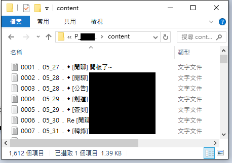

# BS2_Backup
把 BS2 資料備份成一般txt檔形式  
  
支援備份 1.看板文章 2.個人信件  
看板精華區若無子資料夾形式，可當作看板文章  

## 步驟一 BS2備份
1. 登入BS2進入想備份的板  
2. 離開到主畫面，選擇  
 (M)ail      μ 信件典藏盒 μ  
　　(Z)ip        ├ 打包資料 ┤  
 選擇要打包的資料，並寄到信箱  
4. 到信箱下載 "看板名.tgz" 檔案
5. 解壓縮兩次，進入資料夾尋找 .DIR 檔  

## 步驟二 轉成txt檔形式
1. 開啟 BBS_backup.exe 程式，把 .DIR 檔案拉過去，或手動輸入位址  
2. 選擇備份形式 1.看板文章 2.個人信件  
3. 備份檔案會存於 "程式所在/BBS_backup/看板名/" 中  
4. 想修改檔案命名規則，可以更改原始碼第140行
